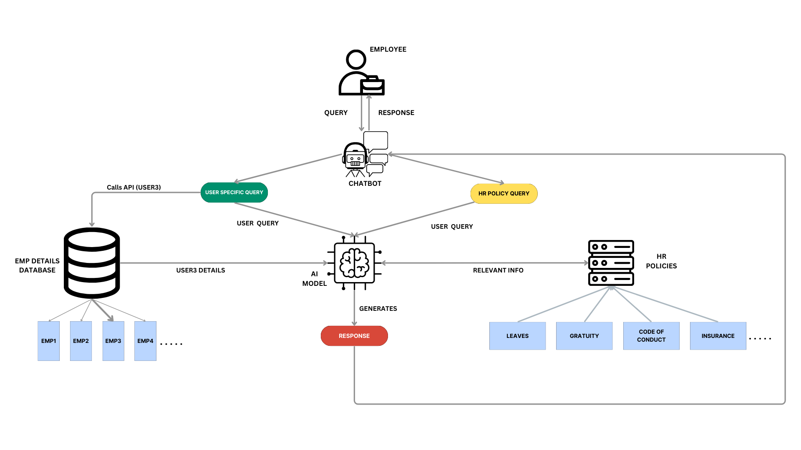

# Workplace-Assistant-Chatbot
**Workplace-Assistant-Chatbot** is an AI-powered chatbot designed to provide quick and accurate responses to employee-related queries within an organization. Leveraging state-of-the-art technologies like LangChain for Retrieval-Augmented Generation (RAG), Pinecone for efficient vector search, and the Mistral model as an LLM, this chatbot helps employees access information about HR policies and personal details effortlessly.

## Features
- **HR Policy Querying**: Leverages Pinecone to store and retrieve vector embeddings of HR policy documents, ensuring accurate and relevant responses.
- **Employee Details Lookup**: Uses a custom LangChain tool to fetch employee-related information from a structured JSON dataset.
- **Intelligent Tool Selection**: Employs LangChain agents to determine the most appropriate tool based on the query, ensuring the right information is retrieved efficiently.

  ## Tech Stack
- **LangChain RAG Approach:** Enhances the chatbot’s ability to generate responses by combining retrieval from a knowledge base with generative LLM capabilities.
- **Pinecone:** Used for storing vector embeddings of HR policies, allowing for fast and relevant document retrieval.
- **Model:** The LLM model from Hugging Face, specifically the `mistralai/Mistral-7B-Instruct-v0.2`, powers the chatbot's natural language understanding and generation.
- **LangChain Tools:** 
  - `PolicyTool`: Retrieves answers based on HR policies stored in PDF format.
  - `JsonTool`: Fetches information from a JSON file containing detailed employee data.
- **LangChain Agents:** Dynamically select the appropriate tool based on the nature of the query.

## Workflow
Below is an image that illustrates the workflow of the Workplace-Assistant-Chatbot, showing how queries are processed, tools are selected, and responses are generated:

## Working
1. **Ask a question:** 
    - For HR policies: "What is the company's leave policy?"
    - For employee details: "Who is the manager of the sales department?"

2. **How it works:**
    - The chatbot analyzes the query and uses LangChain agents to decide whether to fetch information from the HR policies or the employee details JSON file.
    - It then retrieves the relevant information and generates a response using the model by aligning itself with the system prompt created.

## Acknowledgments
- [LangChain](https://github.com/hwchase17/langchain) for providing the framework.
- [Pinecone](https://www.pinecone.io/) for the vector database.
- [Hugging Face](https://huggingface.co/) for the Mistral model.
